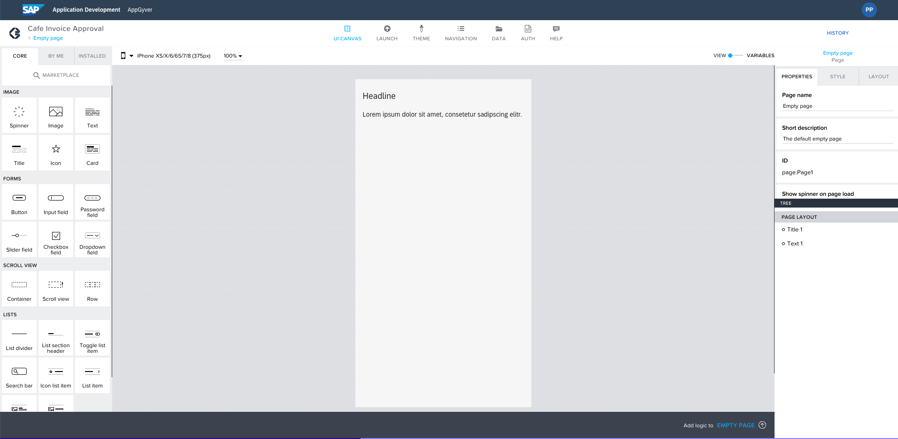

Previous Step: <a href="https://github.com/SAP-samples/process-automation-enablement/tree/main/Workshops/LCNC_Roadshow%20-%20simplified/AppGyver/1%20Create%20a%20new%20project/readme.md"> 1 Create a New Project</a>

# Home Page

1.  You will be redirected to AppGyver Composer, which is like an IDE for AppGyver. In the canvas, you can already see a <b>Title</b> and <b>Text</b> component.

2. On the right-hand side, the properties tab is visible. By default, it shows the properties of the current page you are in.
Under <b>Page name</b> enter “<i>Home Page</i>”.

There are stages of building a page in Application. They are  
 -> Data Connection 
 -> Logic Building 
 -> UI Building 
 
 Not all the pages will have all three stages. The Home page will have 
 
 i. UI Building 
 ii. Logic Building 

Next Step: Previous Step: <a href="https://github.com/SAP-samples/process-automation-enablement/tree/main/Workshops/LCNC_Roadshow%20-%20simplified/AppGyver/2%20Home%20Page/2_1%20UI%20Building/Readme.md">  2_1 UI Building for Home Page</a>
