## Prerequisites
- Complete the first part of the tutorial [1 Create Process](https://github.com/SAP-samples/process-automation-enablement/tree/main/Workshops/LCNC_Roadshow%20-%20simplified/SAP%20Process%20Automation/1%20Create%20Process/spa-dox-create-process.md)
 - Download the [Invoice Document](https://github.com/sap-tutorials/Tutorials/blob/master/tutorials/spa-dox-create-automation/invoice.pdf) to your local machine

## Details
### You will learn
  - How to extract data using Document Extraction Template
  - How to bind parameters between process and automation

---

**Step 1: Create Automation**

1. In the process **Get Invoice Details**:
    - Choose .
    - Select **Automation** > **New Automation**.

   

2. A pop up will appear to configure the Desktop Agent version. Do the following in the pop up:
    - From the dropdown, select the version of the Desktop Agent installed on your machine. During the exercise we would use version **2.0.26**; so please select it.
    - Choose **Confirm**.

    > It would be with suffix as **Registered**.

    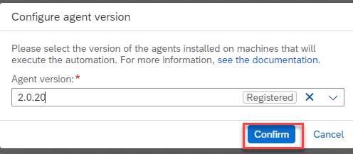

3. A new pop-up will appear to create the automation. Do the following in the pop-up:

    -  Enter **Name** of the automation as **Extract Invoice Data**. You can also use another name you prefer, like **Invoice Data Extraction** and etc.
    -  Enter **Description** of your choice, if needed.
    -  Choose **Create**.    

    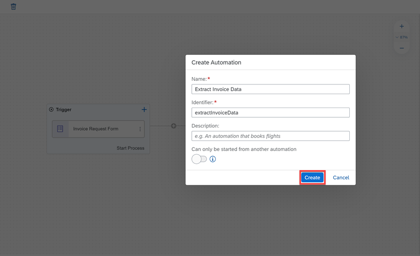

    An automation **Extract Invoice Data** will be created successfully.

    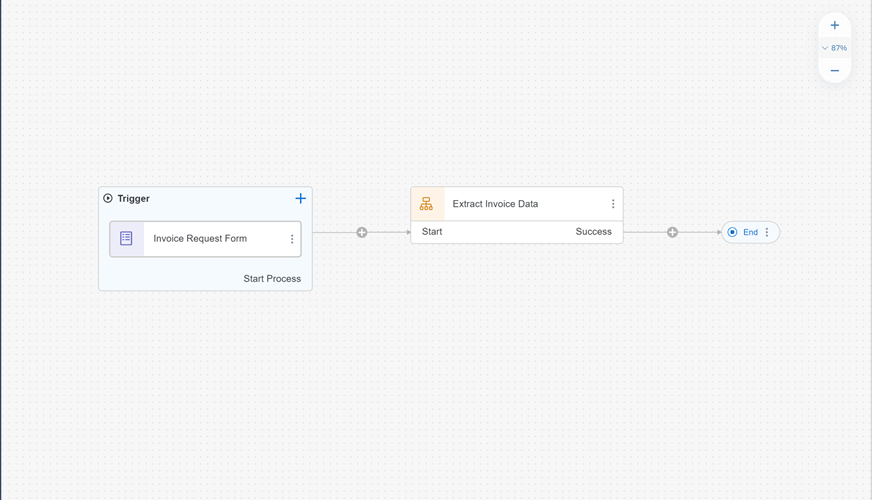

**Step 2: Create Data Types**

1. Create an artifact of the type **Data Type**.

    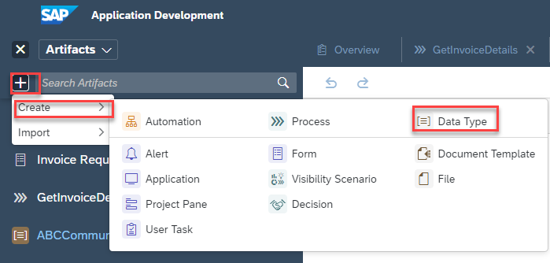

2. Enter the name of the data type as **Invoice** and choose **Create**.

    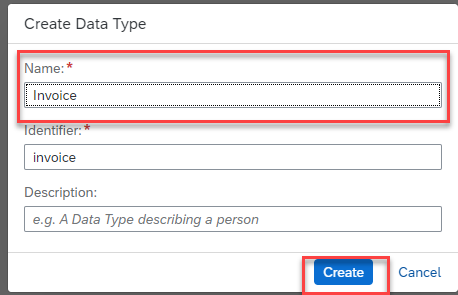

3.  Navigate to Data Types and add new fields as following and choose **Save**.

    |  Field Name     | Type
    |  :------------- | :-------------
    |  `DocumentNumber`| String
    |  `GrossAmount`   | Number
    |  `SenderName`    | String

    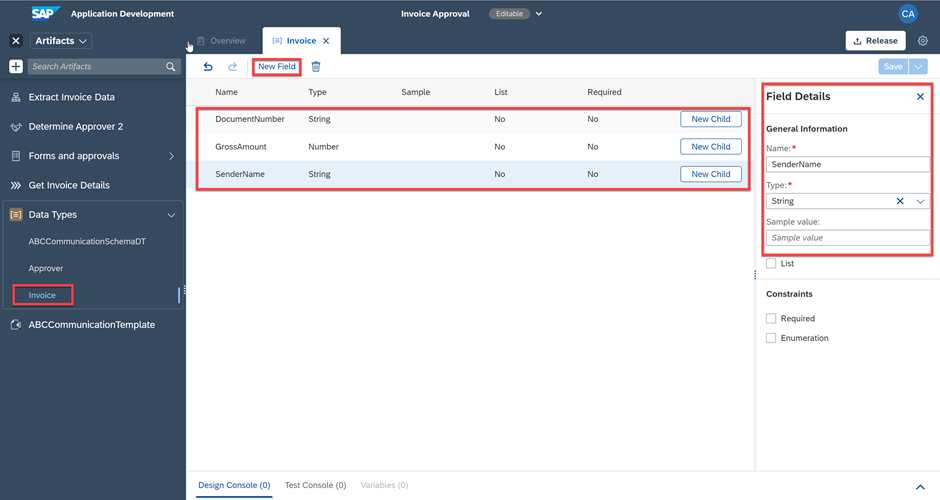

**Step 3: Create Input and Output Parameters**

    Input and output parameters allow you to exchange data in the workflow of your automation between activities, screens, and scripts.

1.  Go back to your automation, which you have previously created.

    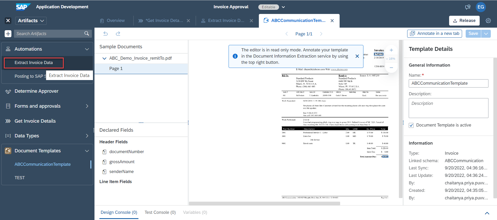

2.  Click on the canvas and select the **Input/Output** section in **Automation Details**.

    

3.  Add Input and Output parameters as following:

    |  Parameter Name       | Data type        | Parameter Type | Description
    |  :---------------     | :-------------   | :------------- | :---------------
    |  `FilePath`      | **`String`**     | Input          | Path where the invoice document is stored  
    |  `InvoiceDetails`    | **`Invoice`** | Output         | Extracted Invoice Details

    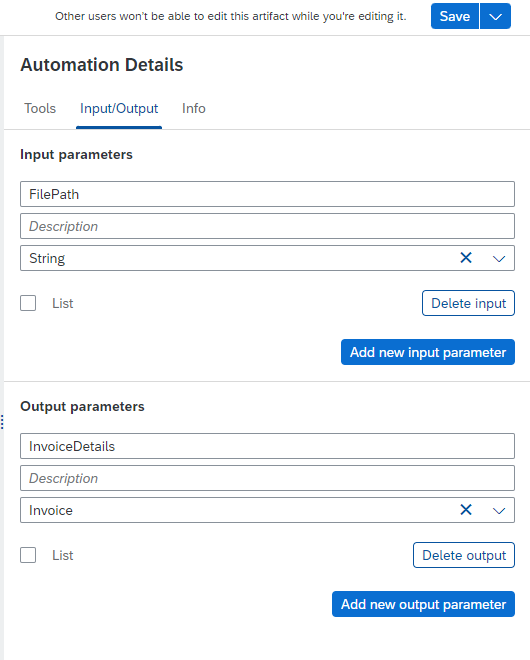

4. Choose **Save**.    

**Step 4: Create Document Template**

1. Create an artifact of type **Document Template**.

    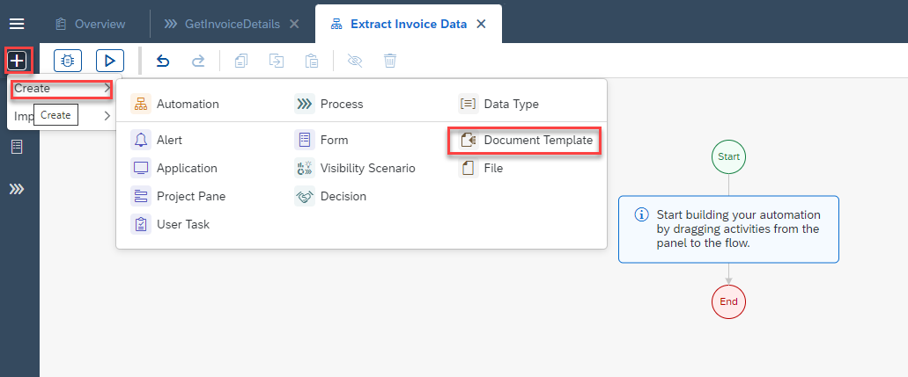

2. Enter the following details:

    - Choose **Create a new template**.
    - Enter the **Name** of the template.
    - Upload the invoice document which you have downloaded from prerequisites.
    - Choose **Next**.

    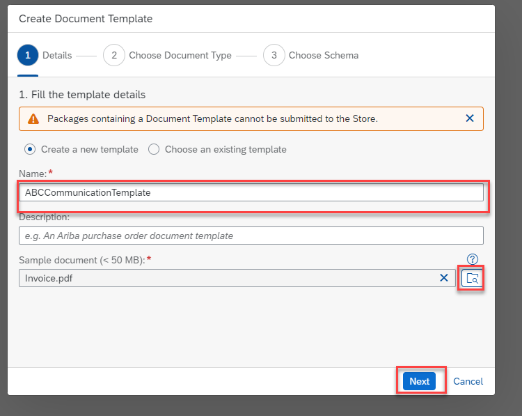

3. Select **Invoice** as the document type of your template and choose **Next**.

    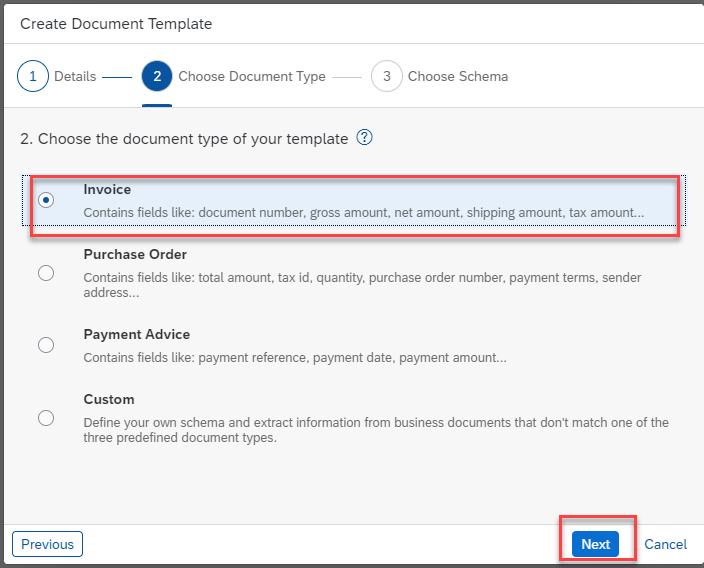

4. Choose your extraction schema.

    - Enter the **Name** of the schema.
    - Choose the fields that you would extract the data from the Invoice document.
    - In this scenario you would select `documentNumber`, `grossAmount`, `senderName`.
  - Choose **Add** only after you select all 3 fields **listed above**.

    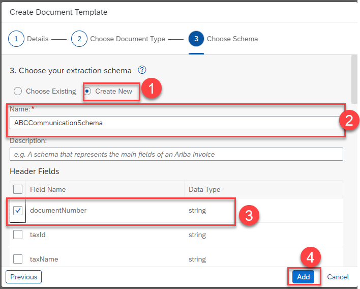

5. Document Information Extraction SDK would be added as dependency to your project and the schema, template are created successfully.

6. Choose **Open in a new tab**.

    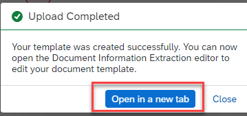

**Step 5: Annotate and Activate the Document Template**

1. You are now navigated to Document Information Extractor. It allows you to edit and annotate the template. To work on Document Information Extractor, please check if you have been assigned to `Document_Information_Extraction_UI_Templates_Admin` role in SAP BTP Cockpit. Otherwise, add the role manually. You would get an error as below if you do not have DOX roles.

    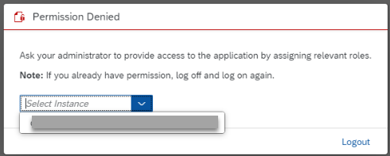

2. Select the **Document Name**.

    

3. Choose  **Annotate**.

    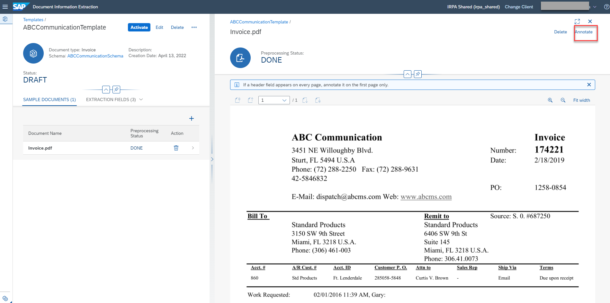

4.  Choose **Edit**.

    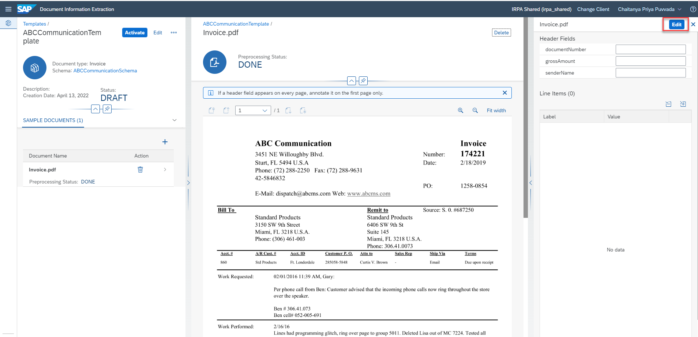

      - Select the data in your invoice document which you would like to extract the information.

        In this scenario, you will read the Document Number, Gross Amount and Sender Name.

      - Select the field  **174228**  in the document and map to the field `documentNumber`.
      - Choose **Apply**.

        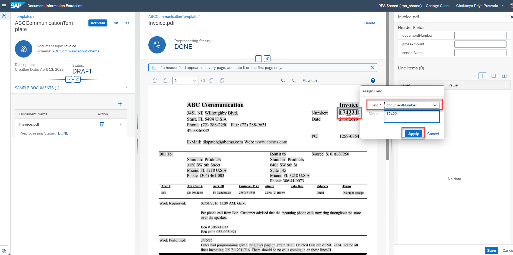

      - Select the value **ABC Communication** in the document and map to the field `senderName`.

        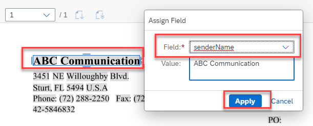

      - Select the value **220** in the document and map to the field `grossAmount`.

        

  5. The mapping of the data in the invoice and fields are mapped. Choose **Save** and then **Activate** the template.
    	
        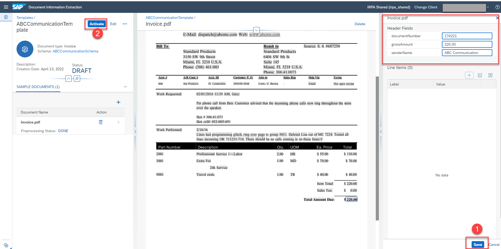

**Step 6: Build the Automation**

1. Extract data template
    - Search for the activity **Extract data** and add the activity **Extract Data (Template)** to the automation flow.
    > ### What is going on?
    > You can extract data with Document Information Extraction using the chosen document template and given PDF file.

    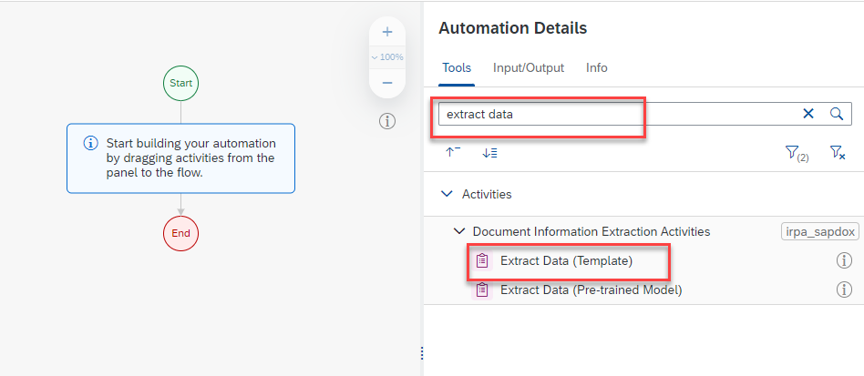

    - Maintain the parameters for the activity as shown below.

    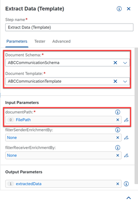

2. You have already created the data type **Invoice** in Step 2. Now, you will create variable of the type **Invoice**.

    - Search for the datatype **Invoice**. You will find it under the **Data** section.

      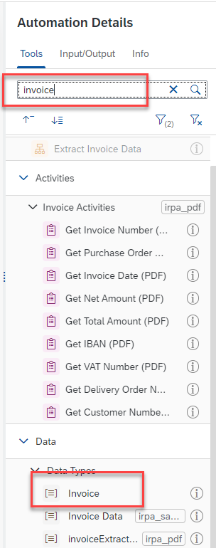

    - Drag and drop  the  data type **Invoice** into the automation flow and select **Create Custom Data** in the parameter **value**.

      

    - Choose the Edit button (pencil icon) to map the parameter `DocumentNumber` to the extracted invoice data from the activity **Extract Data (template)**.

      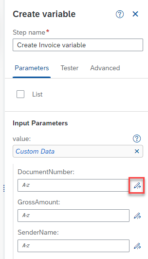

      Here you can either write an expression or select the items from the menu.

      
      

    - Repeat the same for `GrossAmount` and `SenderName` and map it to the corresponding fields of
      `extractedData`.

    - Rename the output parameter to `myinvoiceData`.

    The final input and output parameters of **Create Invoice Variable** looks as below.

    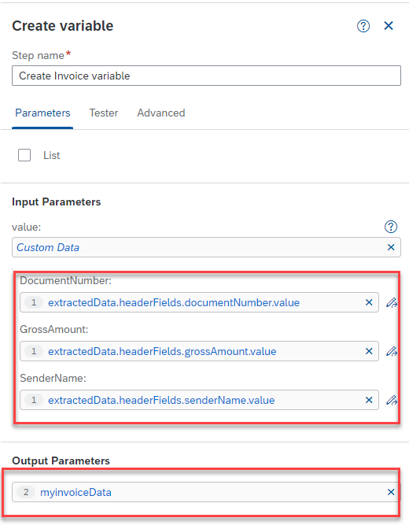

3. Print the invoice data using  the activity **Log message**.

4. Add **Log Message** activity and the `myinvoiceData` to the value.

    > ### What is going on?
    >  With this activity you generate a log message within the tester and the trace file. Useful for setting up an automation. By default, a log will be "Information".

    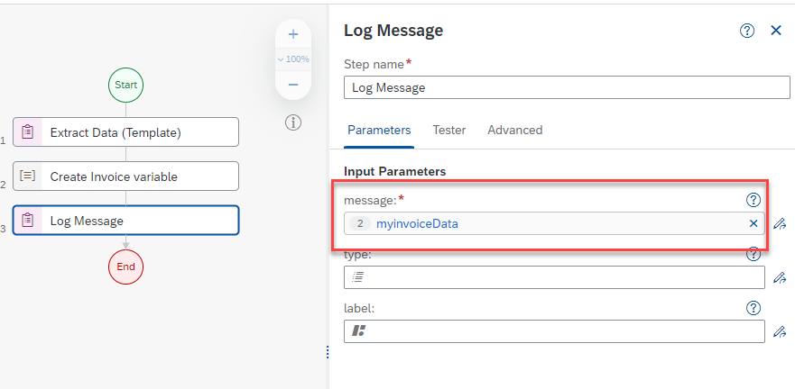

**Step 7: Passing the Parameters Outside the Automation**

1. Select the **End** and pass the variable `myinvoiceData` to the output parameter `InvoiceDetails` which you have created in Step2.

    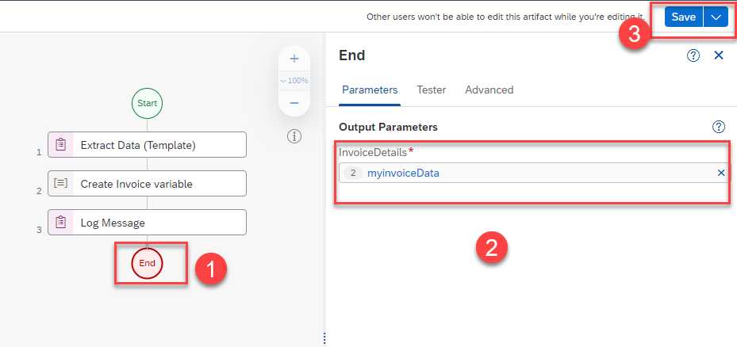

2. **Save** the automation.

**Step 8: Test the Automation**

**OPTIONAL: ONLY IF YOU HAVE THE DESKTOP AGENT CONNECTED TO YOUR TENANT** 

We are using virtual desktop machines connected to the tenant, so please proceed to **Step 9**.

1. Select Test button and enter the `Filepath` where the invoice document is stored locally on your machine.

    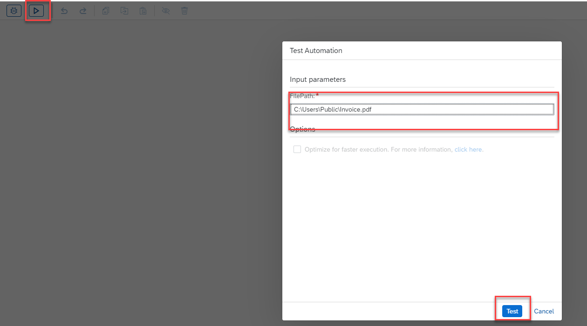

2. The automation opens the Invoice Document, extracts data and prints the details i.e Document number, Gross amount and Sender name.

    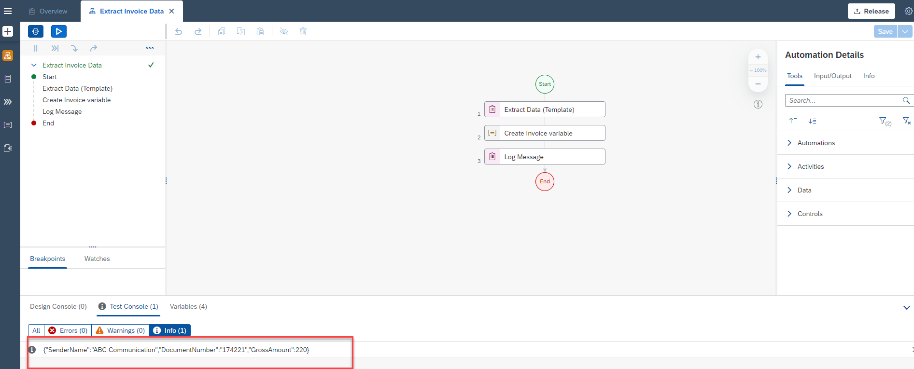

3. Your automation is built successfully.

**Step 9: Mapping of Parameters to the Automation and Process**

1. Navigate to the process **Get Invoice Details** and select the automation **Extract Invoice Data**.

2. Map the input parameter of the automation to the form parameter `FilePath`.

    

3. Your process looks like below once you complete this tutorial.

    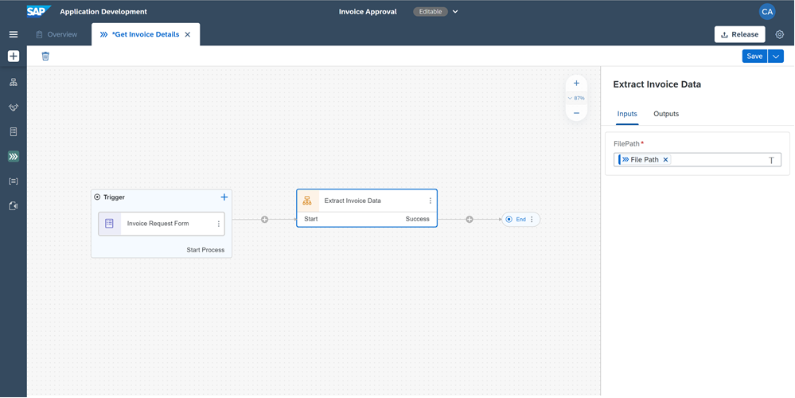

- Continue with the next part of the tutorial [3 Create Decision](https://github.com/SAP-samples/process-automation-enablement/tree/main/Workshops/LCNC_Roadshow%20-%20simplified/SAP%20Process%20Automation/3%20Create%20Decision/spa-dox-create-decision.md)

---
