Previous Step: <a href="https://github.com/SAP-samples/process-automation-enablement/tree/main/Workshops/LCNC_Roadshow/AppGyver/3%20Details%20Page/readme.md"> 3 Details Page</a>

# UI Building for Details Page

1. Remove the <b>Title</b> component by clicking on the <b>x</b> near the Title component. 

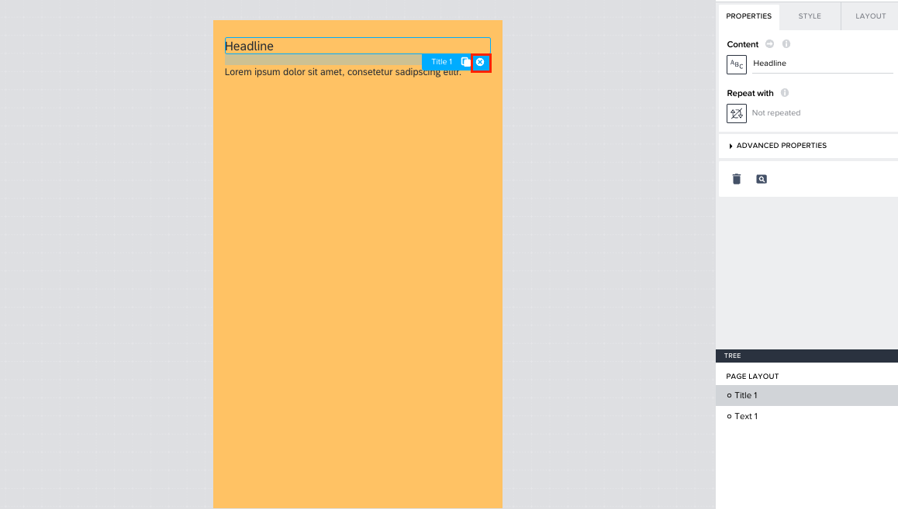

2. Select the <b>Text</b> component, and click on <b>ABC</b> icon under the properties on the right-hand side to open the binding menu for the component.

3. This text component can display a combination of static text and App variables with names that was created in Home page. This combination can be created using <b>formulas</b>.  
In the binding menu, select <b>Formula</b>.  
To learn more about the forumals, please refer <a href="https://docs.appgyver.com/docs/formula-functions?highlight=formil">Using Formula functions</a>

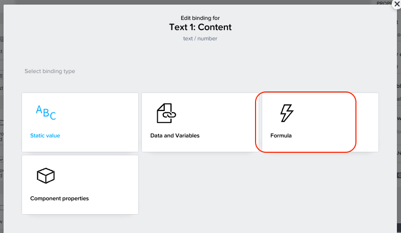

4. In the formula bar, the static text are written within <b>“ “</b> and are distinguished with green font. And it can be concatenated with other functions using <b>+</b> operator. 
In the formula editor enter the following value. <pre> "Hello"+</pre>

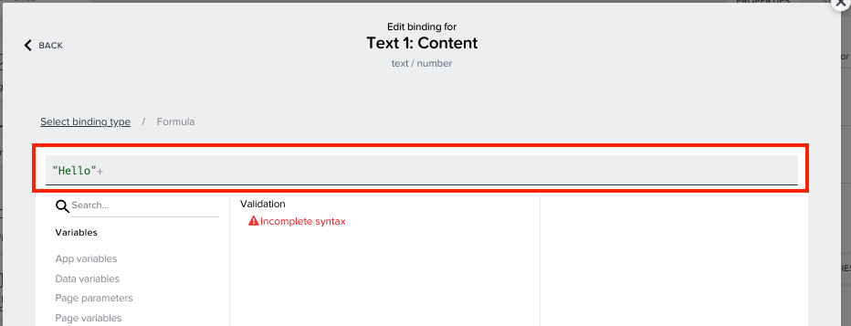

5. Now select App variables, which will show you the available app variables. 
Double click on <b>appVars.FirstName</b> to use the function in your formula.

6. Now add the following value.<pre> +” “+</pre>
and select <b>App variables</b> and double click on <b>appVars.LastName</b> to use the function in your
formula. 

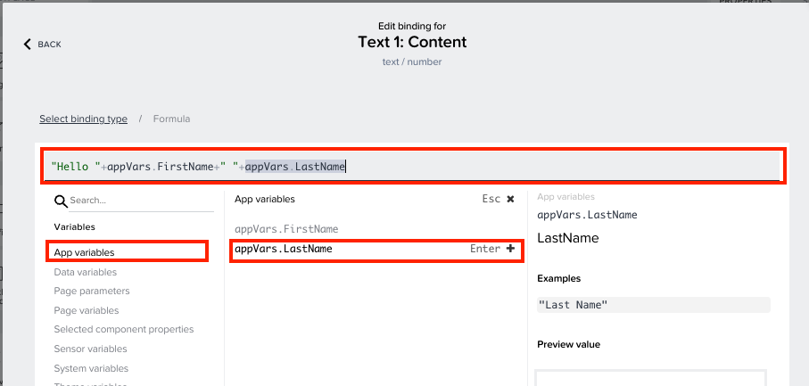

7. Now add the following value to the formula.<pre> 	+", please scan or upload your invoice to submit"</pre>
Under <i>Example results</i>, you can preview how the values will be displayed in the component.  
Click on <b>SAVE</b>. 

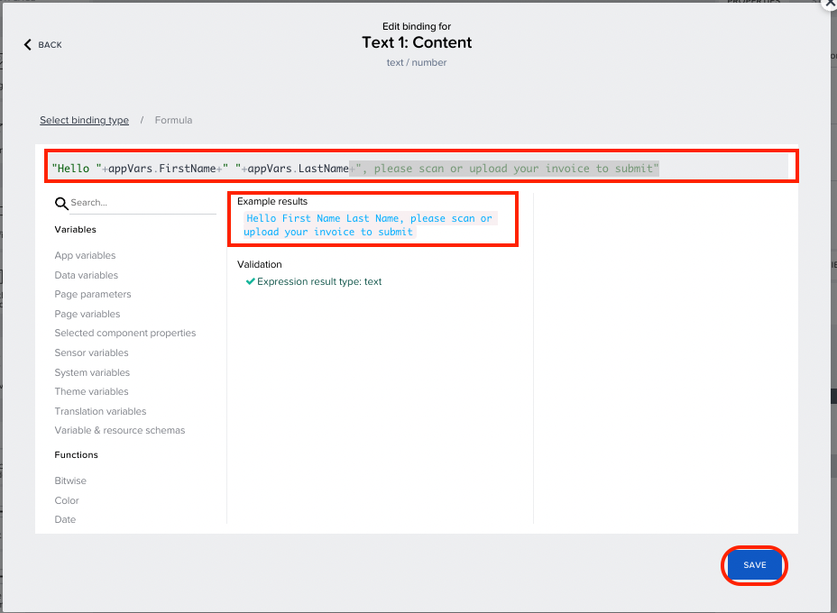

8. Click on <b>SAVE</b> button.

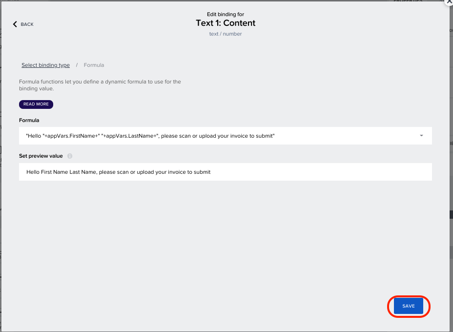

9. In this page we will either scan or upload an image. In order to temporarily save the image in
the page we need to create a page variable. 
To create a page variable switch to <b>Variables</b> view.

10. Select <b>PAGE VARIABLES</b> tab and click on <b>ADD PAGE VARIABLE</b> to create a page variable.

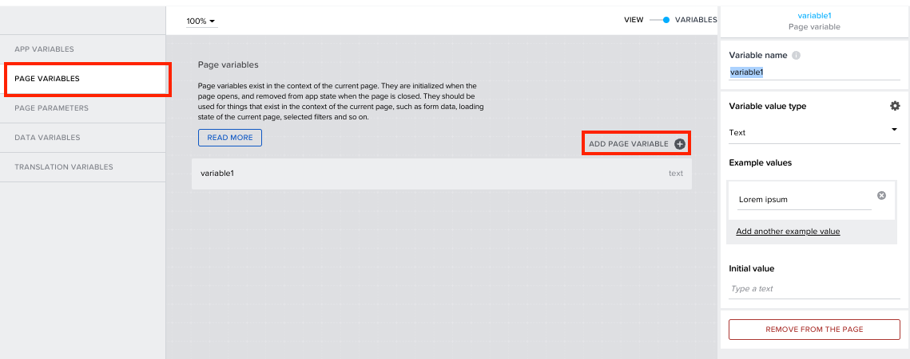

11. Rename the variable to “<i>InvoiceScan</i>”.						
Under <b>Variable value type</b> open the drop-down list and select <b>Local filesystem path</b>.   

The image scanned or uploaded will be temporarily stored in your device, we will use that file
path of the image to access it. 

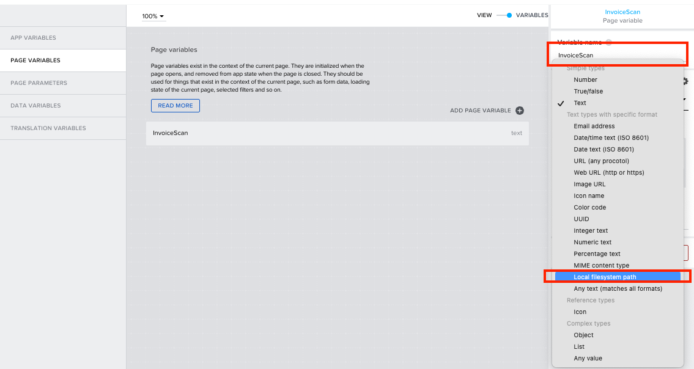

12. Add another page variable and rename it as “<i>filename</i>”.

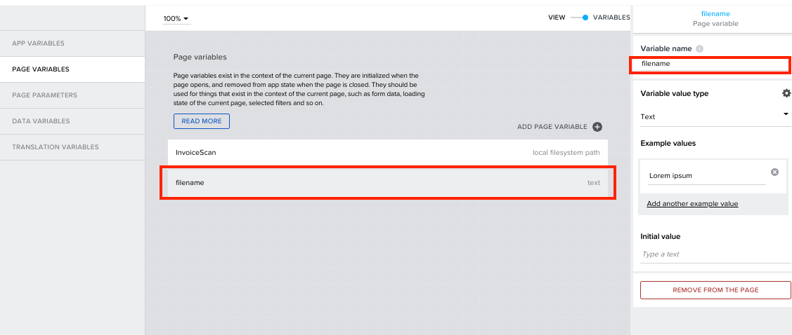

13. Switch back to UI canvas.

14. Now drag and drop a <b>Button</b> component and rename it to “<i>Scan/Upload Invoice</i>”.

15. Drag and drop an <b>Image</b> component, to the canvas. We can bind the variable to this image component. Open the binding menu of the image under properties on the right-hand side.

16. In the binding menu, select <b>Data and Variables</b>.

17. Select <b>Page variable</b>.

18. Select <b>InvoiceScan</b> variable and click on <b>SAVE</b> button.

19. Drag and drop another <b>Button</b> from the component library to the UI canvas and rename it to "<i>Submit</i>".

20. This submit button needs to be visible only after the Invoice is selected. We can change the visibility properties. Expand the <b>ADVANCED PROPERTIES</b> of the Button 2 component.  Open the binding menu for under for Visible option of the component.

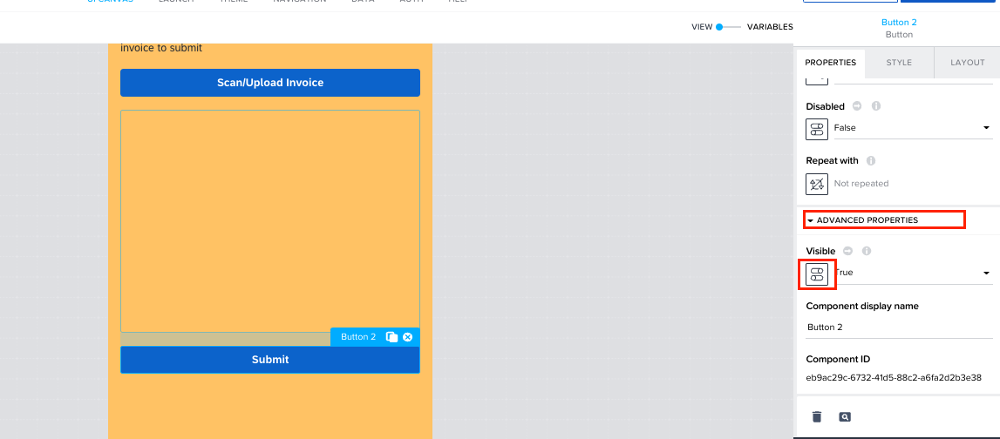

21. <b>InvoicScan</b> variable is used to store the image. So, a simple formula can be used to check if the variable is empty and define the visibility for this button.     In the binding menu select <b>Formula</b>.

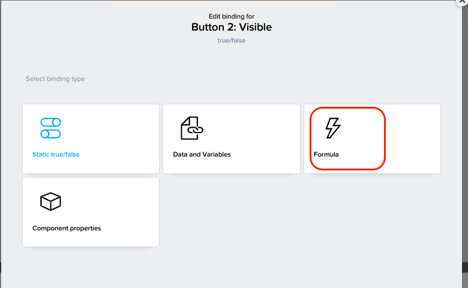

22. In the formula bar enter the following formula.
<pre>IF(IS_EMPTY(pageVars.InvoiceScan),false,true)</pre>
This formula checks if the <b>InvoiceScan</b> page variable is empty, then the output will be false and component will
be disabled. If the <b>InvoiceScan</b> page variable have some value, the output will change to
true, and component will be displayed.  
Click on <b>SAVE</b>.

23. In the properties menu of the Submit button component, switch to <b>STYLE</b> tab and select <b>Success Button</b>.

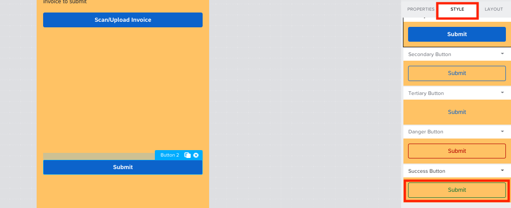

Next Step: <a href="https://github.com/SAP-samples/process-automation-enablement/tree/main/Workshops/LCNC_Roadshow/AppGyver/3%20Details%20Page/3_2%20Data%20Connection/Readme.md"> 3_2 Data Connection for Details Page</a>

