# 01 - The Basics

## Table of Contents
- [Description](#section1)
- [Overview](#section2)
- [Requirements](#section3)
- [Create Business Process Project](#section4)
- [Create Business Process](#section5)
- [Create Trigger Form](#section6)
- [Support](#support)
- [License](#licence)

## 1. Description 

**SAP Process Automation** enables business users and technologists to become citizen developers. With powerful yet intuitive low-code and no-code capabilities, the solution supports you in driving automation by tapping into the expertise of citizen developers. It combines capabilities from SAP Workflow Management and SAP Intelligent RPA with a powerful, yet intuitive no-code development experience. The solution offers the following key features:
   
   - Build processes with an intuitive graphical interface
   - Create forms-based workflows using drag-and-drop functionality
   - Develop and manage decision logic in tabular, spreadsheet-like decision tables
   - Automate repetitive tasks within existing process flows using robotic process automation
   - Support real-time, event-driven transparency into comprehensive processes and process instances with process-visibility dashboards

## 2. Overview 

In this section, you will do basic tasks that includes:
  - Create a Project that will contain all the artifacts
  - Create a Process that will automate the Sales Order Creation and Approvals
  - Create a Form to trigger the Process

## 3. Requirements 

- Access to a [**SPA Tenant**] (provided by the instructors) and a **Windows machine** with On-premise components installed, are required to run the entire workshop.
- The Desktop Agent setup [Documentation](https://help.sap.com/viewer/a331c4ef0a9d48a89c779fd449c022e7/Cloud/en-US/860145601cc64167ac5a17089ebd7cce.html).
- Download the [Excel File](../2%20Automation/SalesOrdersDetails.xlsx) which would be used in the Automation.

## 4. Create Business Process Project 

1. In the **Lobby**, click on **Create**.

    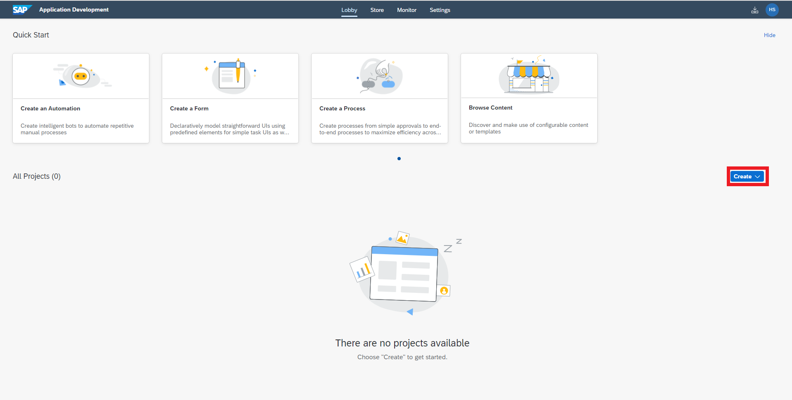

2. Click **Business Process**.

    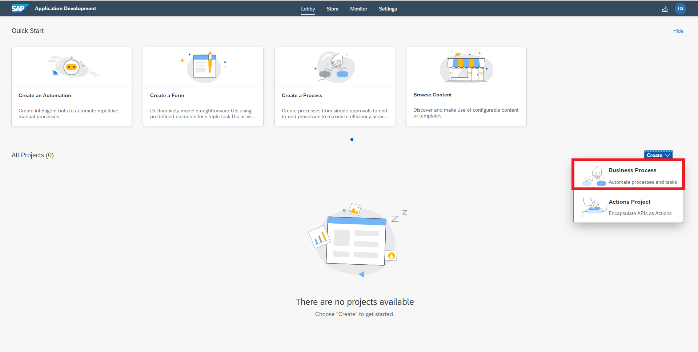
    

3. In the pop-up, do the following:
    - Enter **Project Name** of your choice but ensure that it is unique. 
      > - As this workshop is conducted on a shared sub-account (and not on trial or free-tier) so the project name has to be unique. 
      > - Suggestion: append your User Name or User ID to the project name to make it unique. For Example: Sales Order Management XYZ.
    - Enter **Short Description** of your project, if you want.
    - Click **Create**.

    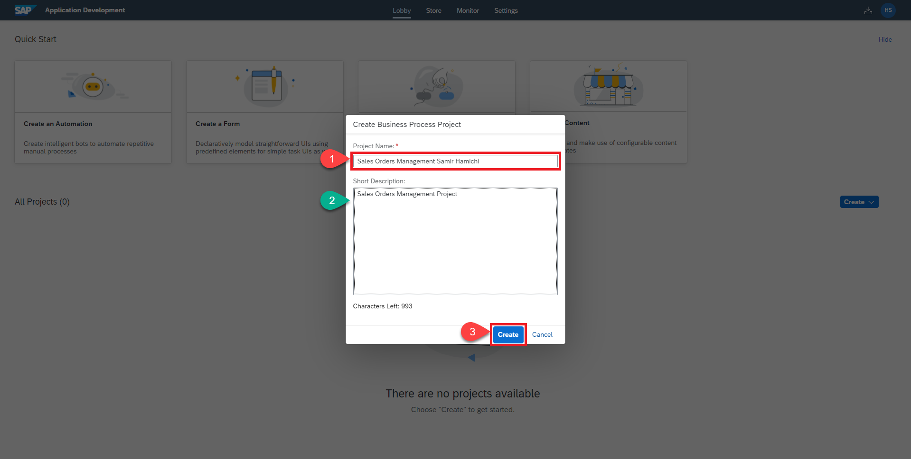
    

## 5. Create Business Process 

1. In the **Project Overview**, click on **Create**.

    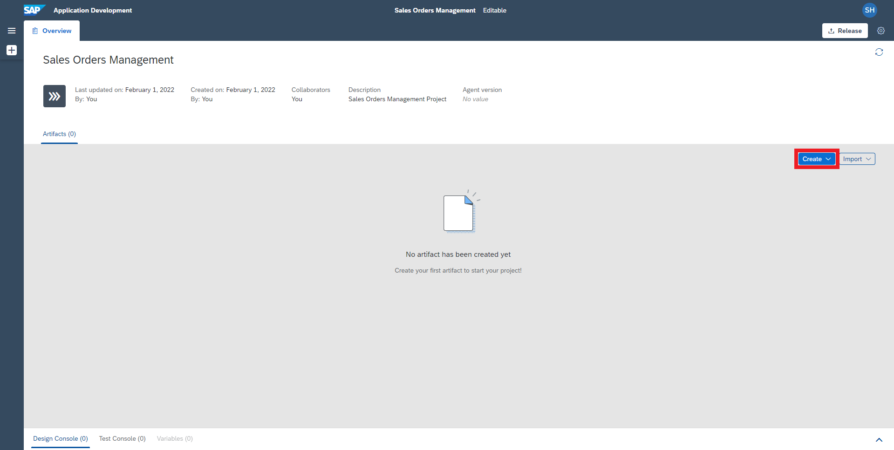

2. Click **Process**

    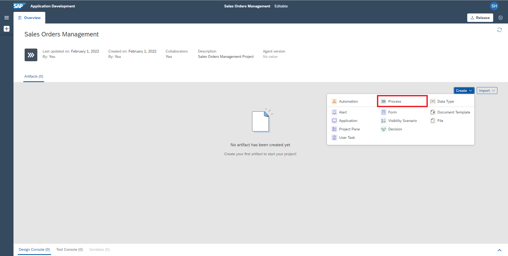

3. In the pop-up, do the following:
    - Enter the **Name** field.
    - Enter **Description** to your process.
    - Click **Create**.
    > The process **Identifer** field is auto-filled!

    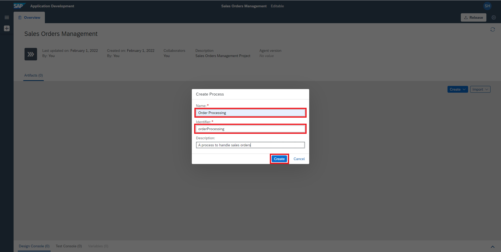

4. Click on the **Select a Start Trigger** node.

    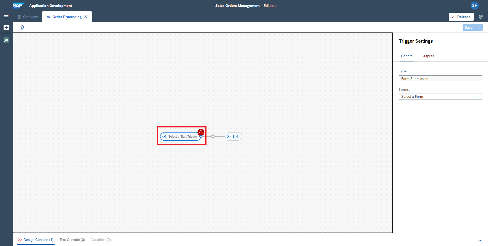

5. Choose **New Form** in the **Forms** field.

    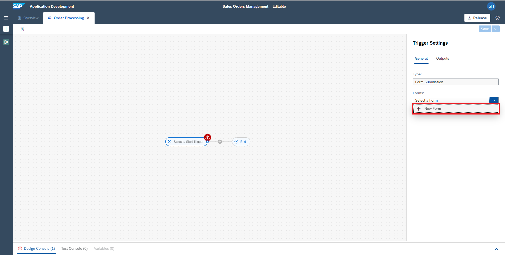

## 6. Create Trigger Form 

1. In the pop-up for new form, do the following:
    - Enter the **Name** as **Order Processing Form**.
    - Enter a **Description** of your choice.
    - Click **Create**.

    > The form **Identifer** field is auto-filled!

    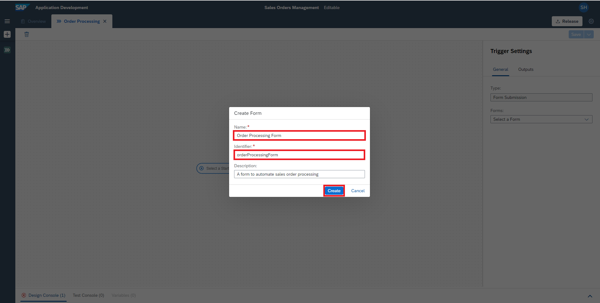

2. Click **Save** and open the **Artifacts Panel**.

    

3. Click **Order Processing Form** artifact to open the form.

    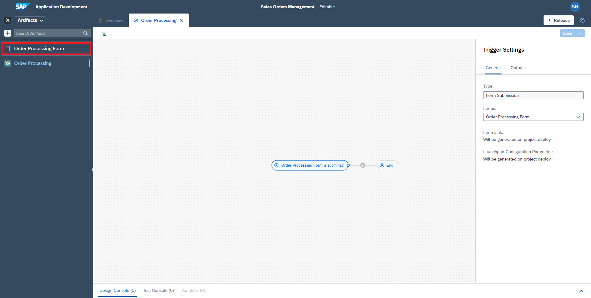

4. Click 4 times on the **Text Input** under **INPUT FIELDS**.
    > this will add four text boxes in the form

    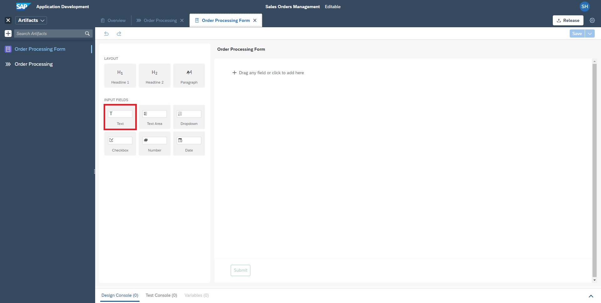

5. Click on the first input box, set the **Field Name** to **Order Number** and set it as **Mandatory**.

    

6. Click on the second input box, set the **Field Name** to **Customer Name** and set it as **Mandatory**.

    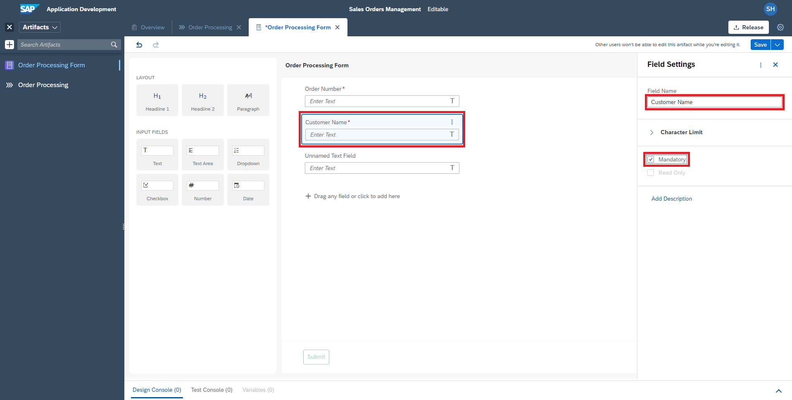

7. Click on the third input box, set the **Field Name** to **Order Status**.

    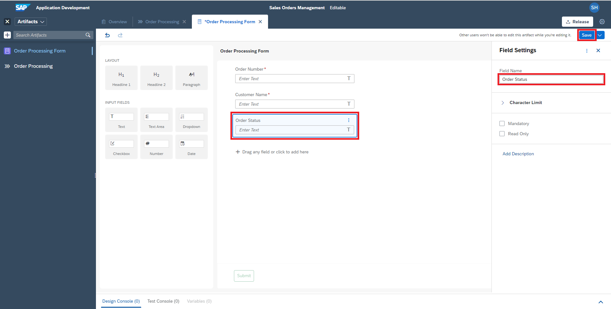

8. Click on the fourth input box, set the **Field Name** to **Approver Email**.

    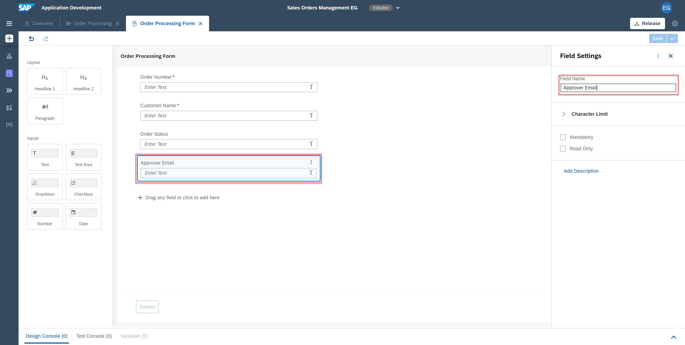

#### Your Process and Trigger form is ready!

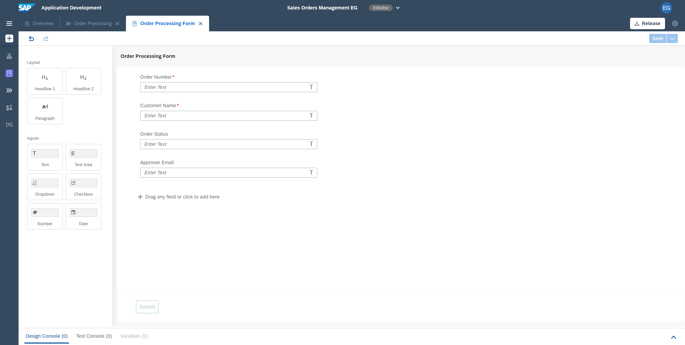

## How to obtain support 

Support for the content in this repository is available during the actual time of the online session for which this content has been designed. Otherwise, you may request support via the [Issues](../../../../issues) tab.

## License 

Copyright (c) 2022 SAP SE or an SAP affiliate company. All rights reserved. This project is licensed under the Apache Software License, version 2.0 except as noted otherwise in the [LICENSE](../LICENSES/Apache-2.0.txt) file.
