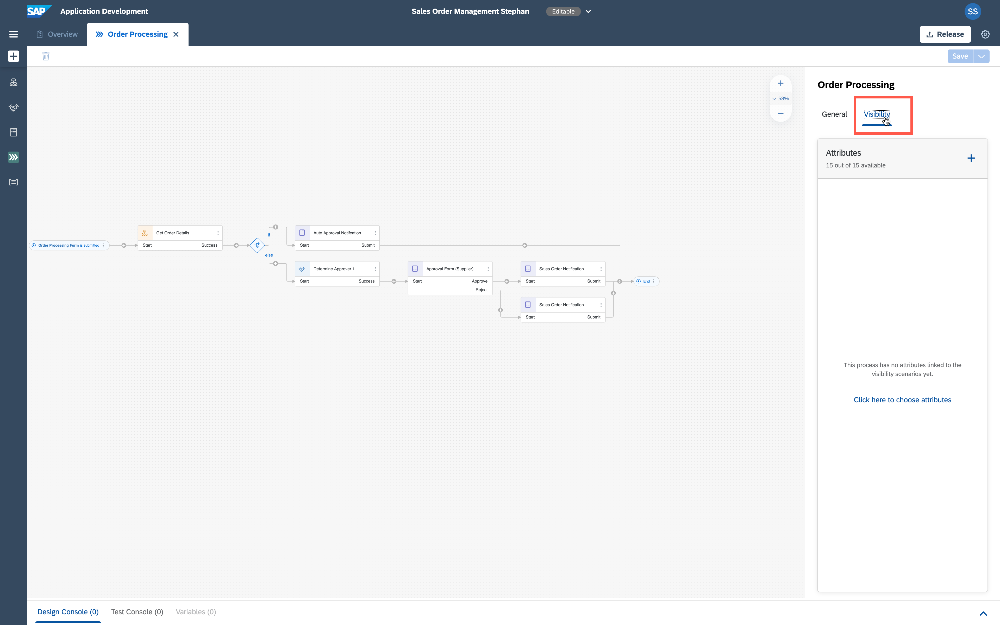
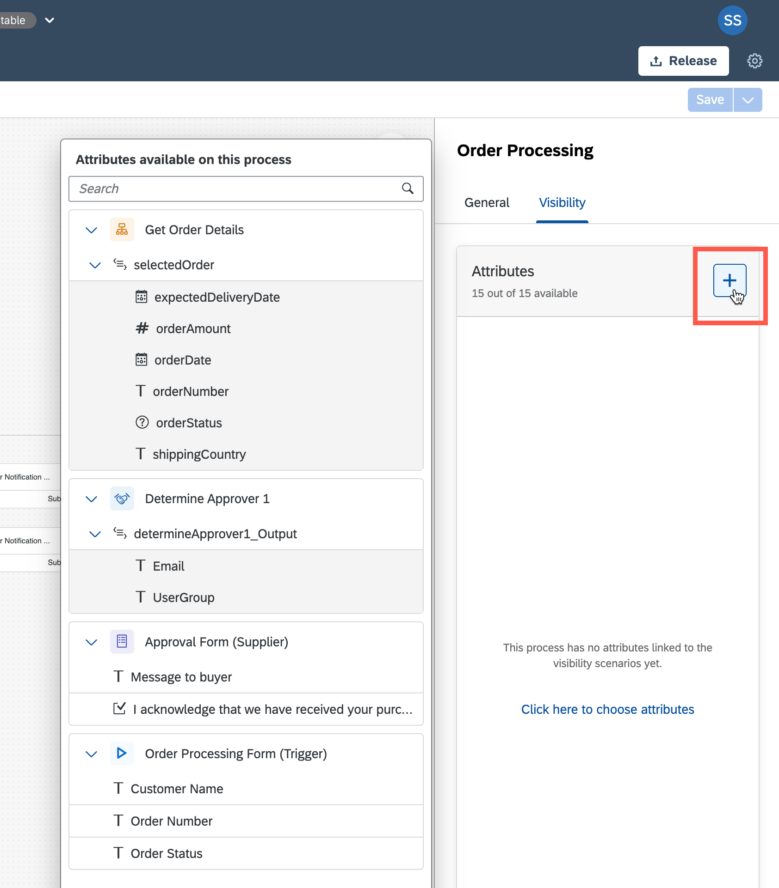
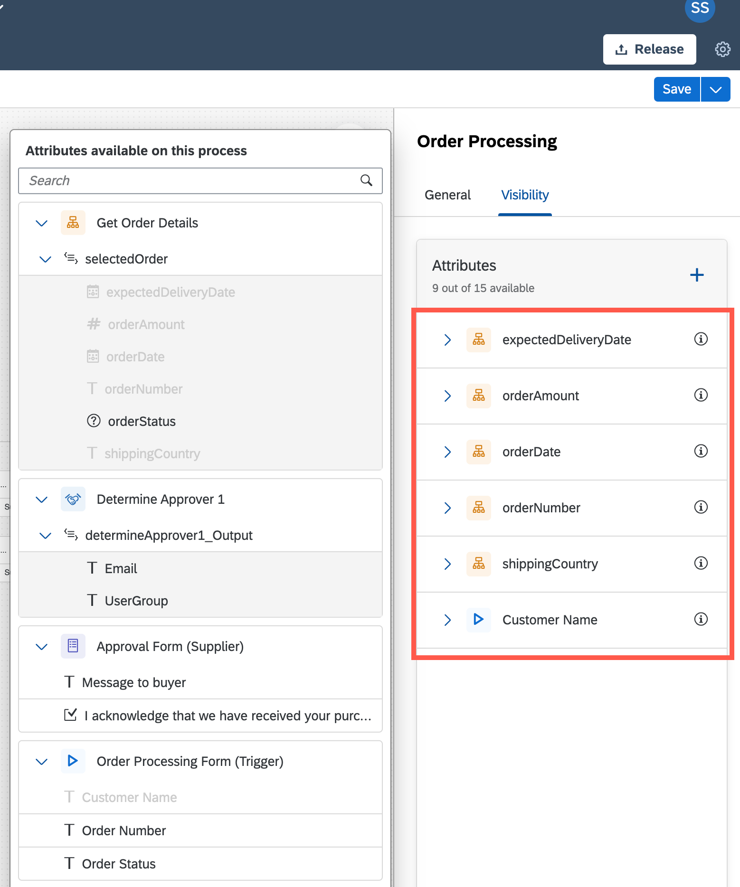
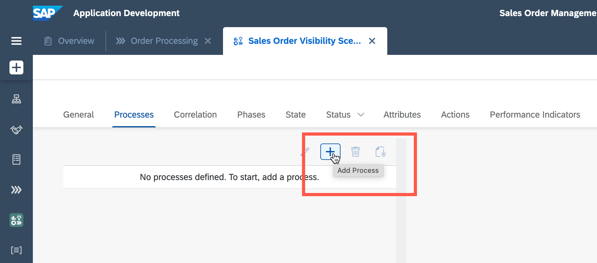
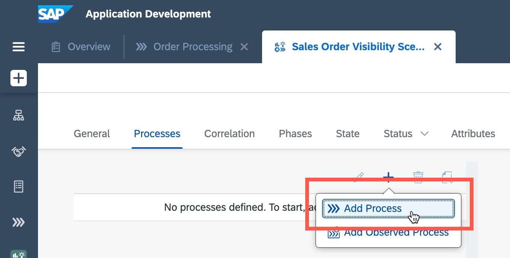
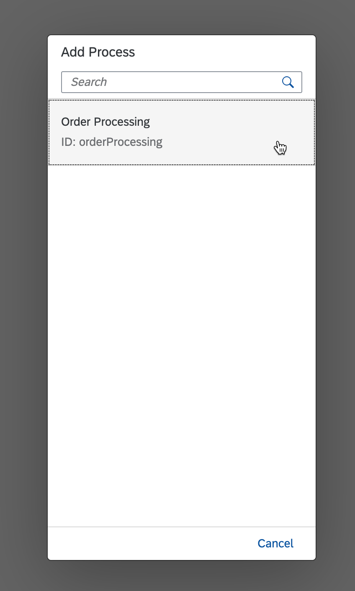
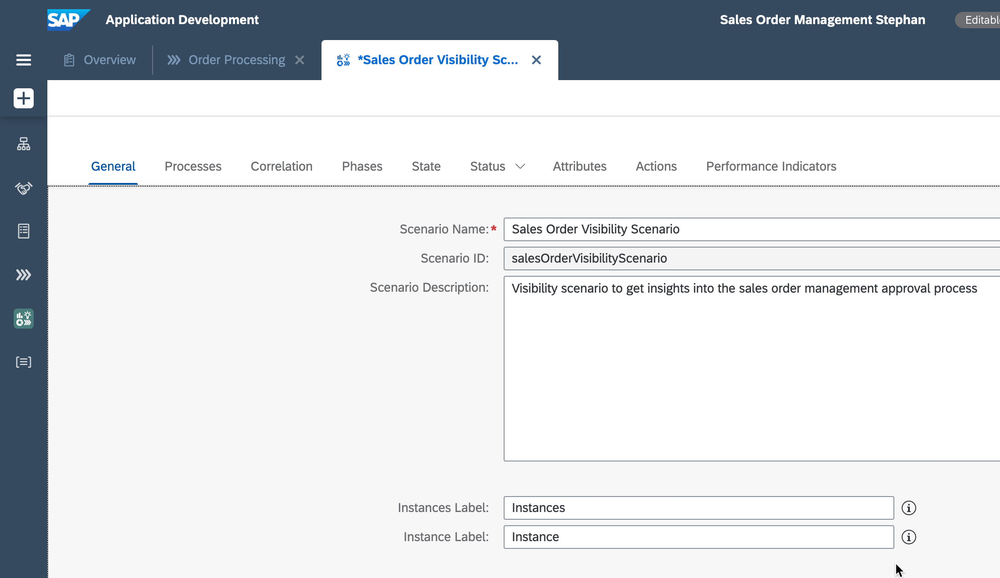
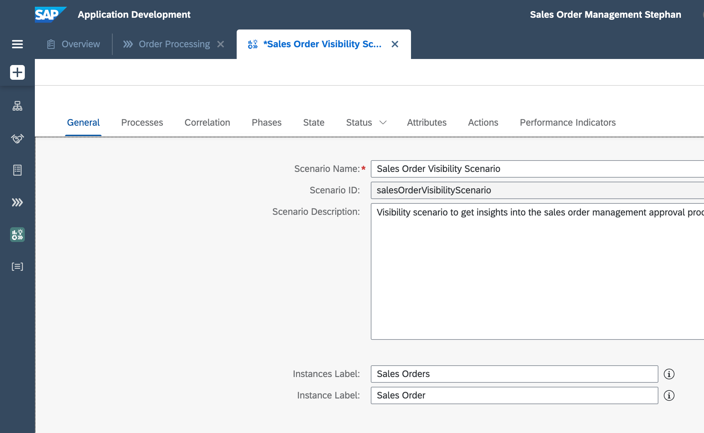
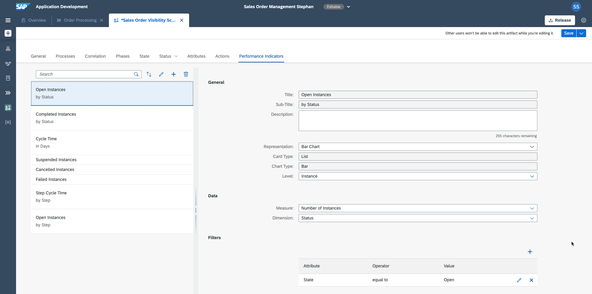

# 5 Create a Visibility Scenario

Visibility scenarios allow you to measure and track the performance of the process. Based on the process context you are able to define several performance indicators, use pre-defined ones or even create actions.

In this exercise you will
- [Prepare your process](#section1)
- [Create a scenario](#section2)
    - [Configure the process](#section3)
    - [Define the status](#section4)
    - [Configure performance indicators](#section5)

## Prepare your Process
1. In the **Process Builder** open your process and on the right-hand side select the tab **Visibility**.

    

    > Here you define the connection between the process context and the newly to be created visibility scenario.

2. Click on the plus sign to add the relevant attributes.

    

3. Add the following attributes, you just need to click the ones which are needed:

    - expectedDeliveryDate
    - orderAmount
    - orderDate
    - orderNumber
    - shippingCountry
    - Customer Name
    
    And then you should have this result:
    
    
    
4. Save your work.

    
    
    
## Create a Visibility Scenario
1. Move back to the **Overview** of your project and select **Create -> Visibility Scenario**.

    
    
2. In the upcoming wizard maintain the required information. Please ensure you use a **unique name**, to make it easier to identify your scenario later on.    

    
    
### Configure the Process
3. Now add a new process to your visibility scenario, start this by clicking the plus sign.

    
    
4. In the drop down list, select **Add Process** to get access to all the context and events data of a process.

    
    
5. Select your process.

    
    
    Then the result should look similar like here:
    
    
    
    >Please take a look at the related process context data and events. In the visibility scenario you can make use of all of them and create powerful measures and dashboards.
    
6. Though we want to change some of the context data, to be more precise, adapt the data types. Change within the following context data the data types, **click the pencil icon**:

    
    
    | Name     | Current Data Type | New Data Type |
    | ----------- | ----------- | -------- |
    | expectedDeliveryDate      | String      | Date
    | orderAmount   | String        | Double
    | orderDate   | String        | Date
    
        

    This should be your result:
    
      
    
7. Next move to the tab **General** where we will change the **Instances Label** and **Instance Label** from **Instances** to **Sales Orders** and from **Instance** to **Sales Order**.
> To make it better understandable what the instances are processing: Sales Orders.

   Before:
     
   
   After:
     
   

### Define the Status

8. Move to the tab **Status**.
> Here you have the possibility to define under which circumstance a process instance will change the status to require special treatment or actions.

9. Change the **Target Type** from **None** to **Constant**.

     
    
10. You will see pre-configured data, which we will change now. Adapt the **Target Value** to **10 Min** and the **Threshold** to **50%**.
    
   
   Changed to
    
   
   > The means: as soon as processing duration crosses 5 minutes, the status will switch to "At Risk". After 10 minutes it will change to "Critical".

### Configure Performance Indicators

11. Move to the tab **Performance Indicators** and add additional ones or leave them as is.

     
    
12. **Save** your work.

We are ready!

## Summary 

You have now configured a visibility scenario which is related to your process. Based on this configuration a dashboard will be created which you can use the measure the performance, but to also get deep insights into single instances and even trigger actions. Remark: the creation of actions we have not covered here.

You are now able to:
- [x] Prepare your process
- [x] Create a scenario
- [x] Configure the process
- [x] Define the status
- [x] Configure performance indicators

## Next chapter

Now, move on with **[06 Run](https://github.com/SAP-samples/process-automation-enablement/tree/main/Workshops/Workshop%20A%20-%20short/6%20Run)**.

## How to obtain support 

Support for the content in this repository is available during the actual time of the online session for which this content has been designed. Otherwise, you may request support via the [Issues](https://github.com/SAP-samples/process-automation-enablement/issues) tab.

## License 

Copyright (c) 2022 SAP SE or an SAP affiliate company. All rights reserved. This project is licensed under the Apache Software License, version 2.0 except as noted otherwise in the [LICENSE](../LICENSES/Apache-2.0.txt) file.

